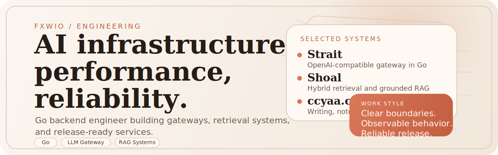

  

  <a href="https://ccyaa.cn">Blog</a>
   · 
  <a href="https://github.com/fxwio">GitHub</a>
   · 
  <a href="mailto:wang.fuxiang@outlook.com">Email</a>

  Engineer focused on AI infrastructure, system performance, and reliability.

## About

I build Go services for AI workloads, with a focus on AI infrastructure, system performance, and reliability.

My bias is toward small surfaces, explicit boundaries, and systems that stay understandable under load, during failure, and through release.

## Selected Work

### [Strait](https://github.com/fxwio/strait)

Minimal OpenAI-compatible AI gateway written in Go, covering token auth, rate limiting, provider and model routing, request forwarding, SSE streaming proxy, health checks, metrics, and graceful shutdown. Its current release boundary is validated up to `1000 QPS / 1m` on the test machine.

### [Shoal](https://github.com/fxwio/shoal)

Production-oriented RAG service in Go with asynchronous document ingestion, hybrid retrieval via PostgreSQL FTS + `pgvector`, RRF fusion, grounded answer generation with citations, and persistent conversation memory.

### [ccyaa.cn](https://ccyaa.cn) / [www](https://github.com/fxwio/www)

My writing and design space, built with Astro. I use it to publish notes on AI infrastructure, RAG systems, Go backends, performance engineering, and the tradeoffs behind real implementations.

## How I Work

- Build for clear boundaries, observable behavior, and rollback from day one.
- Treat latency, throughput, failure handling, and maintainability as first-class design constraints.
- Prefer releasable slices over oversized platforms.

## Toolbox

- Backend: `Go` `gRPC` `REST` `OpenAI-compatible APIs`
- Data: `PostgreSQL` `pgvector` `Redis` `Kafka`
- Delivery: `Docker` `Kubernetes` `metrics` `smoke tests`
- Web and writing: `Astro` `Markdown`

## Elsewhere

- Writing: [ccyaa.cn](https://ccyaa.cn)
- Code: [github.com/fxwio](https://github.com/fxwio)
- Contact: [wang.fuxiang@outlook.com](mailto:wang.fuxiang@outlook.com)
